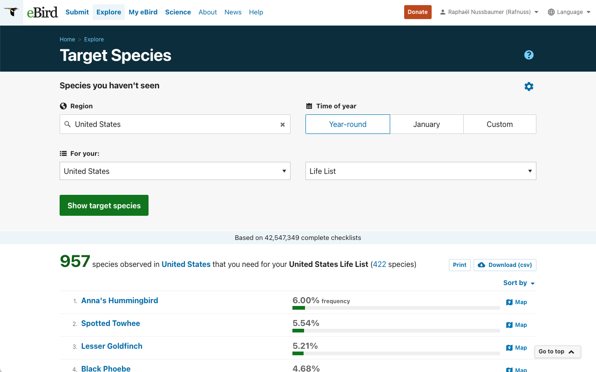
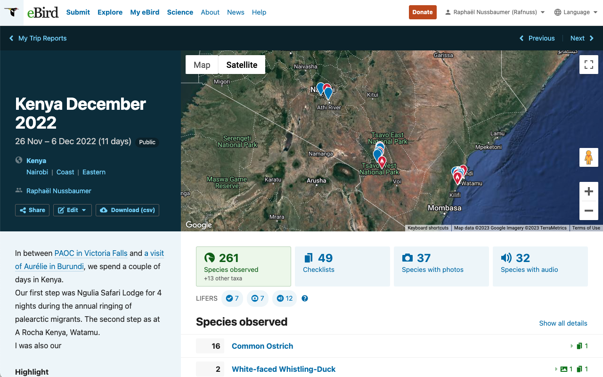
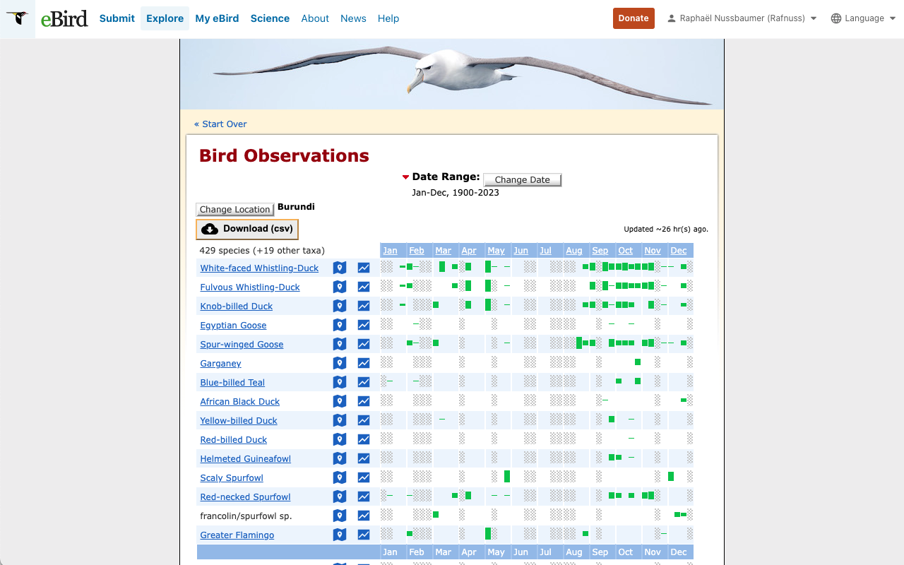
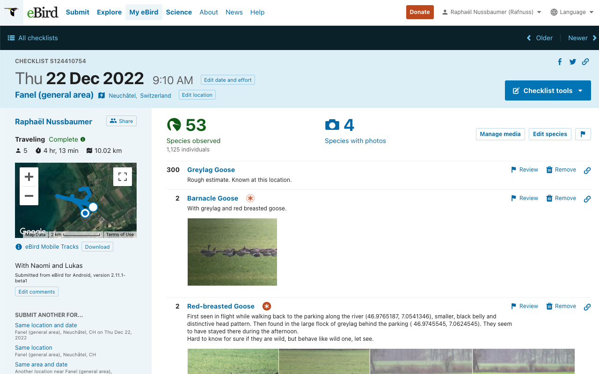
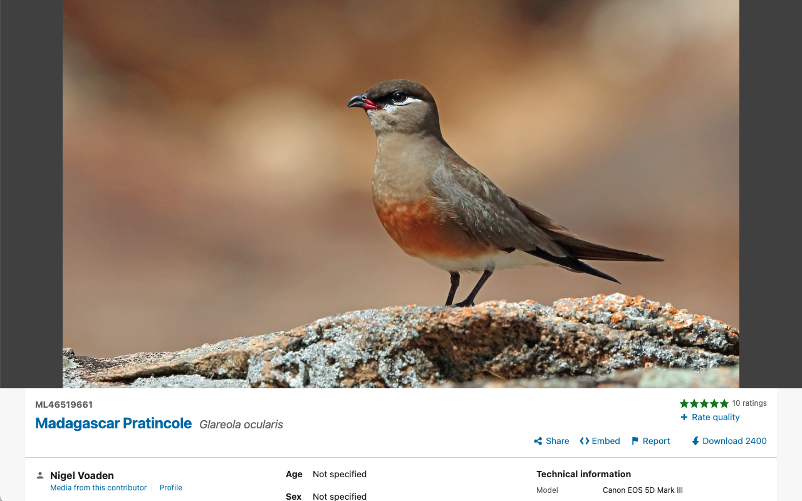
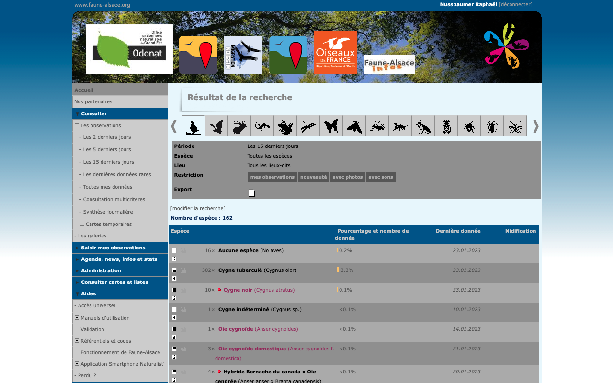
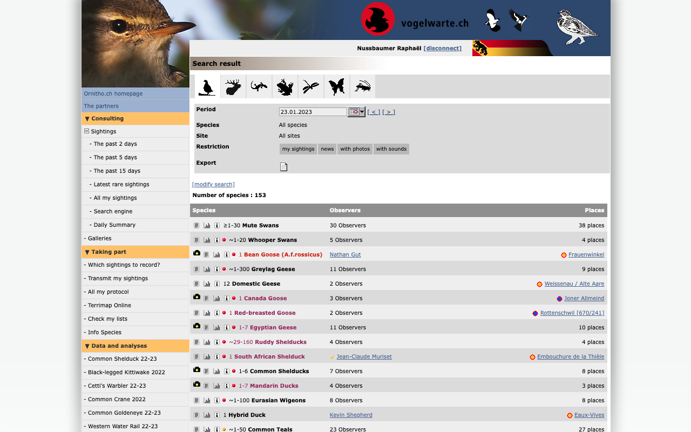

# Zoziologie Chrome Extension

A set of tools to make your life easier on eBird and Biolovision (ornitho, faune-...)

- [Zoziologie Chrome Extension](#zoziologie-chrome-extension)
  - [How to install?](#how-to-install)
  - [eBird](#ebird)
    - [1. Export Target](#1-export-target)
    - [2. Export Trip report](#2-export-trip-report)
    - [3. Export Barchart](#3-export-barchart)
    - [4. Checklist: anchor link to species, Export GPS track and Manage location](#4-checklist-anchor-link-to-species-export-gps-track-and-manage-location)
    - [5. Download Pictures](#5-download-pictures)
  - [Biolovision](#biolovision)
    - [1. Export Species List](#1-export-species-list)
    - [2. Export Summary](#2-export-summary)
    - [2. Export Lit](#2-export-lit)

## How to install?

Install the extension directly from the [chrome web store](<[Zoziologie](https://chrome.google.com/webstore/detail/zoziologie/ikoemgmlmapdnjkphgficpdlkfiepodh)>)!

## eBird

### Export Target as CSV

Export your [Target](https://ebird.org/targets) list into a [comma-separated value (csv)](https://en.wikipedia.org/wiki/Comma-separated_values) using the new button "Download (csv)" next to "Print". The exported table contains the following columns:

| `rank` | `speciesCode` | `commonName` | `sciName`       | `frequency` | `exoticCategory` \* |
| ------ | ------------- | ------------ | --------------- | ----------- | ------------------- |
| 1      | brant         | Brent Goose  | Branta bernicla | 1.77%       | Native              |

\* one of `Native`, `Naturalized`, `Provisional`, `Escapee`. Note that hybrids are identifiable from `commonName`.

### Search for Region as target

By default, in the target page, you can only search for parent region in the "For your: " list. With this extension, you can now search for any region. This is specifically useful when search target at a specific hotspot for its parent region. 

### Export Trip report as CSV

Export your [trip report](https://ebird.org/mytripreports) into a csv using the new button "Download (csv)" next to share and edit. There are three possible export:

**Species Level**

|speciesCode|category  |commonName|sciName  |numIndividuals|numChecklists   |numPhotos |numAudio                                                      |numVideo   |isLifer   |numMedia|exoticCategory|isPhotoLifer|isAudioLifer|
|-----------|----------|----------|---------|--------------|----------------|----------|--------------------------------------------------------------|-----------|----------|--------|--------------|------------|------------|
|ostric2    |species   |Common Ostrich|Struthio camelus|9             |2               |0         |0                                                             |0          |FALSE     |0       |              |FALSE       |FALSE       |

**Observation Level**

|*same as species level* |subId     |obsDt|locName  |howMany|
|------------|----------|-----|---------|-------|
|*same as species level*        |S212383195|08.02.2025 10:20|Dassenberg Drive, Western Cape, ZA (-33.463, 18.445)|6      |

**Checklist Level**

|locId    |subId     |numSpecies|obsDt    |obsTime|isoObsDate      |subID     |name                                                          |latitude   |longitude |countryCode|countryName |subnational1Name|subnational1Code|isHotspot|locName                                                       |hierarchicalName                                                                |locID    |lat        |lng       |
|---------|----------|----------|---------|-------|----------------|----------|--------------------------------------------------------------|-----------|----------|-----------|------------|----------------|----------------|---------|--------------------------------------------------------------|--------------------------------------------------------------------------------|---------|-----------|----------|
|L40063346|S212444111|1         |08.Feb.25|18:25  |08.02.2025 18:25|S212444111|West Coast Road, Cape Town, Western Cape, ZA (-33.586, 18.399)|-33.5855343|18.3994637|ZA         |South Africa|Western Cape    |ZA-WC           |FALSE    |West Coast Road, Cape Town, Western Cape, ZA (-33.586, 18.399)|West Coast Road, Cape Town, Western Cape, ZA (-33.586, 18.399), Western Cape, ZA|L40063346|-33.5855343|18.3994637|

### 3. Export Barchart

Export a [barchart](https://ebird.org/GuideMe?cmd=changeLocation) data into a csv using the new button "Download (csv)" on top of the table.

First row is the normalization factor (i.e., number of checklists). There are 48 periods: 4 per months.

| `speciesCode` | `category` | `commonName`     | `sciName`     | `exoticCategory` | `Jan1` | `Jan2` | `...` | `Dec4` |
| ------------- | ---------- | ---------------- | ------------- | ---------------- | ------ | ------ | ----- | ------ |
|               |            |                  |               |                  | 247    | 259    | ...   | 257    |
| bahgoo        | species    | Bar-headed Goose | Anser indicus | N                | 0      | 0      | ...   | 0      |

### 4. Checklist: anchor link to species, Export GPS track and Manage location

- **Anchor link to species**: To share a specific sighting within your checklist, click on the link icon at the end of the line to copy the url of this entry on your clipboard. When opening this link, the page will automically scroll to this sighting.
- **Manage location** (not visible on screenshot below): A new button, next to "Edit Location" will help you to nagivate to the Location page directly.

### 5. Download Pictures

Download any photos on the Macaulay library at 2400px wide resolution (the original is only available for the author) using the new button "Download 2400".

## Biolovision

### 1. Export Species List

Create csv files from Biolovision **Specie List** (`m_id=94`) pages using the csv button on the export row. This output page is selected on the last tab of the **search engine** page (`m_id=8`). The exported table contains the following columns:

| `number` | `common_name` | `scientific_name` | `latest_date` | `breeding` | `link_observation`                                                                                                                                                                                                                                                                                          | `link_stat`                                                                    | `link_info`                                                                                  |
| -------- | ------------- | ----------------- | ------------- | ---------- | ----------------------------------------------------------------------------------------------------------------------------------------------------------------------------------------------------------------------------------------------------------------------------------------------------------- | ------------------------------------------------------------------------------ | -------------------------------------------------------------------------------------------- |
| 31       | Greylag Goose | Anser anser       | 06.01.2020    | certain    | <https://www.ornitho.ch/index.php?m_id=94&showback=stor&p_c=5&p_cc=-1&sp_tg=1&sp_DateSynth=02.06.2020&sp_DChoice=offset&sp_DOffset=5&sp_SChoice=species&sp_S=60&sp_PChoice=canton&sp_cC=000100110000000000000011001001100000000000000000000&sp_FChoice=list&sp_FDisplay=DATE_PLACE_SPECIES&sp_DFormat=DESC> | <https://www.ornitho.ch/index.php?m_id=81&frmSpecies=60&sp_tg=1&showback=stor> | <https://www.ornitho.ch/index.php?m_id=15&showback=stor&backlink=skip&frmSpecies=60&sp_tg=1> |

### 2. Export Summary

Create CSV files from Biolovision **Summary** (`m_id=32`) pages using the csv button on the export row. This output page is selected on the last tab of the **search engine** page (`m_id=8`). The exported table contains the following column:

| `number` | `common_name` | `observers` | `place`  | `link_photo`                                                                                        | `link_observations`                                                                                                                                                                                                                                                                                                                 | `link_stat`                                                                             | `link_info` |
| -------- | ------------- | ----------- | -------- | --------------------------------------------------------------------------------------------------- | ----------------------------------------------------------------------------------------------------------------------------------------------------------------------------------------------------------------------------------------------------------------------------------------------------------------------------------- | --------------------------------------------------------------------------------------- | ----------- |
| ~40      | Greylag Geese | 2 Observers | 2 places | <https://www.ornitho.ch/index.php?m_id=15&showback=stor&backlink=skip&y=2020&frmSpecies=60&sp_tg=1> | <https://www.ornitho.ch/index.php?m_id=94&showback=stor&p_c=5&p_cc=-1&sp_tg=1&sp_DateSynth=01.06.2020&sp_DChoice=range&sp_DFrom=01.06.2020&sp_DTo=01.06.2020&sp_SChoice=species&sp_S=60&sp_PChoice=canton&sp_cC=000100110000000000000011001001100000000000000000000&sp_FChoice=list&sp_FDisplay=DATE_PLACE_SPECIES&sp_DFormat=DESC> | <https://www.ornitho.ch/index.php?m_id=81&frmSpecies=60&showback=stor&cDate=2020-06-01> |

### 2. Export Lit

Create CSV files from Biolovision **List** (`m_id=94`) pages using the csv button on the export row. This output page is selected on the last tab of the **search engine** page (`m_id=8`). The exported table contains the following column:

| `date`   | `place`                                | `place_link`                                                  | `number` | `common_name`     | `scientific_name`  | `remark`                                  |
| -------- | -------------------------------------- | ------------------------------------------------------------- | -------- | ----------------- | ------------------ | ----------------------------------------- |
| 06.01.24 | Widensolen (village) / Widensolen (68) | <https://www.faune-grandest.org/index.php?m_id=52&id=1153273> | 2        | Bécasses des bois | Scolopax rusticola | Remarque :observation de mon salon en vol |

_No screen shot_
